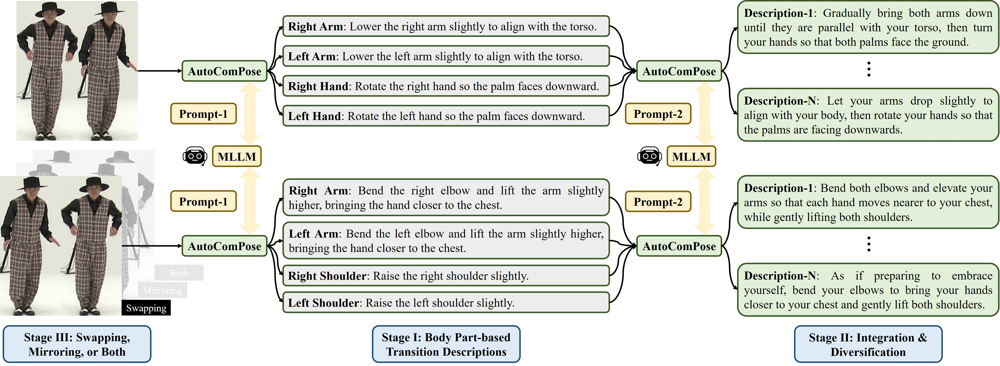

# AutoComPose (ICCV 2025)

[ [arXiv](https://arxiv.org/abs/2503.22884) ]



This repository serves as the official placeholder for the code, data, and models accompanying our paper *AutoComPose: Automatic Generation of Pose Transition Descriptions for Composed Pose Retrieval Using Multimodal LLMs* (ICCV 2025).

## Installation

This project is developed based on [CLIP4Cir](https://github.com/ABaldrati/CLIP4Cir). For additional details, background information, and related resources, please refer to the original repository.

```sh
git clone https://github.com/DennisShen/AutoComPose.git
conda create -n autocompose -y python=3.8
conda activate autocompose
conda install -y -c pytorch pytorch=1.11.0 torchvision=0.12.0
conda install -y -c anaconda pandas=1.4.2
pip install git+https://github.com/openai/CLIP.git
```

## Getting Started

### Dataset and Models

The dataset and pretrained models used in this project will be released soon. Please check back later for download links.

### Dataset Sources

The datasets used in this project—FIXMYPOSE, PoseFixCPR, and AIST-CPR—are adapted from existing public datasets. Please refer to the original sources for full dataset details. For information on how these datasets were adapted in this project, please refer to our paper.

- [FIXMYPOSE](https://fixmypose-unc.github.io/) - *FixMyPose: Pose Correctional Captioning and Retrieval* (AAAI 2021)
- [PoseFix](https://europe.naverlabs.com/research/publications/posefix-correcting-3d-human-poses-with-natural-language/) - *PoseFix: Correcting 3D Human Poses with Natural Language* (ICCV 2023)
- [AIST++](https://google.github.io/aichoreographer/) - *AI Choreographer: Music Conditioned 3D Dance Generation with AIST++* (ICCV 2021)

### Project Structure

Please organize your files according to the following directory structure:

```sh
AutoComPose/
├── /src
```

## Citation

If you use this code for your research, please cite our papers.
```
@article{shen2025autocompose,
  title={AutoComPose: Automatic Generation of Pose Transition Descriptions for Composed Pose Retrieval Using Multimodal LLMs},
  author={Shen, Yi-Ting and Eum, Sungmin and Lee, Doheon and Shete, Rohit and Wang, Chiao-Yi and Kwon, Heesung and Bhattacharyya, Shuvra S},
  journal={arXiv preprint arXiv:2503.22884},
  year={2025}
}
```